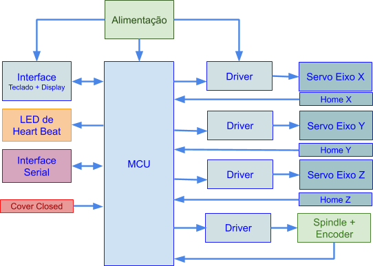
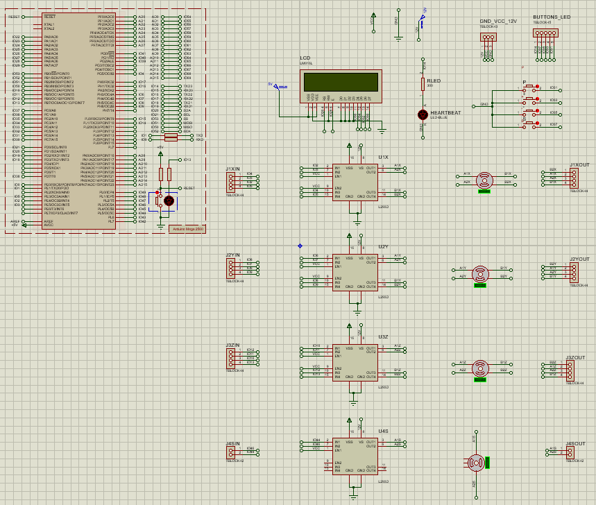

# Router CNC

+ ## Descrição geral do sistema:

  + Um Router CNC é basicamente uma fresadora controlada eletronicamente por um
    sistema microprocessado e acionada por servomotores. A estrutura mecânica básica
    consiste em 3 eixos ortogonais, X, Y e Z, e um eixo rotativo, normalmente denominado eixo
    árvore ou spindle. 
    Está estrutra é comum a outros tipos de equipamentos industriais, apenas
    substituindo o eixo rotativo pela aplicação específica desejada. Por exemplo, um cabeçote
    extrusor, Figura 2, para uma impressora 3D ou um cabeçote Laser para uma cortadora a
    laser.

    + #### Diagrama de blocos do sistema:

      

        
      

    + #### Diagrama esquemático do sistema:
    
    

     
     

     
+ ## Interface

  + O bloco de interface contém um display LCD 16x2 e 4 botões além da Interface Serial. A interface
    deverá apresentar a posição atual dos eixos e velocidade do spindle bem como possibilitar a
    modificação do estado da máquina, referência, manual ou automático.
  
   + O display apresenta 5 telas, sendo elas a tela inicial, de erro, de referenciamento, de posição e de fim de curso               positivo, as quais serão explicadas na seção **Funcionamento**. 

    + Os botões do teclado servem para:
      + P: Ativar/Desativar e Selecionar eixo para movimento manual.
      + +: Movimenta eixo no sentido positivo, horário (CW).
      + -: Movimenta eixo no sentido negativo, anti-horário (CCW)
      + S: Liga spindle em manual.
      
      
      

        
      

      
    + Se o modo manual não estiver ativado, o controlador aceita comandos pela entrada
      serial, os comandos permitidos são listados abaixo:
      
      | Eixo    | Comando        | Descrição                                                                                                                                                                                                                            | Exemplo                                                                                                               |
      |---------|----------------|--------------------------------------------------------------------------------------------------------------------------------------------------------------------------------------------------------------------------------------|-----------------------------------------------------------------------------------------------------------------------|
      | Spindle | S=             | Ajusta a velocidade (em RPM) de giro do eixo Spindle. Limites: Mínimo: 200 RPM Máximo: 2000 RPM                                                                                                                             | S=1000 Ajusta a velocidade em 1000RPM, mas não liga o eixo.                                                  |
      |         | M3             | Liga o eixo spindle no sentido CW                                                                                                                                                                                                    |                                                                                                                       |
      |         | M4             | Liga eixo spindle no sentido CCW                                                                                                                                                                                                     |                                                                                                                       |
      | Eixos   | F=             | Modifica a velocidade de movimento dos eixos X, Y e Z.  Lento, Medio, Rapido                                                                                                                                                   | F=Medio Ajusta a velocidade de deslocamento para a velocidade média, mas não movimenta nenhum eixo. |
      |         | X= Y= Z= | Comanda o movimento para o eixo especificado. Caso mais de um eixo seja comandado na mesma mensagem, os eixos deve ser interpolados linearmente, válido somente para os eixo X e Y. *Respeitar os limites de curso | X=100 Move o eixo X para a posição 100 X=10Y=5 Move ambos os eixos com interpolação linear.         |

    + As mensagens recebidas devem estar entre os caracteres delimitadores de início ($) e final (#) de mensagem. 
      + Exemplos de mensagem válida: 
          + Ex1.: Ajustar a velocidade do spindle para 1000 RPM, ativar o giro no sentido CW,
          ajustar a velocidade de movimento dos eixo em rápido e mover o eixo Z para a
          posição 10.
             

             <mark>$S=1000M3Z=10F=Rapido#</mark>
             

          + Ex2.: Mover eixo X para a posição 10 e o eixo Y para a posição 5. Neste caso os
          eixo movem com a última velocidade ajustada (Lento, Medio, Rapido ).
            

            <mark>$X=10Y=5#</mark> 
            

    + ## Funcionamento

      + 

    

     
     

  
  
+ ## Periféricos

  + **Chaves e Sensores:** São utilizadas chaves normalmente abertas para simular o comportamento dos sensores de referência (Home) e de proteção aberta (Cover Closed).
  + **MCU:** O microcontrolador é o ATMEGA328P (Arduino Mega 2560).
  + **Driver:** O driver utilizado é o circuito integrado L293D - Quadruple Half-H Drivers.
  + **Motor dos eixos** São utilizados motores de passo bipolares.
  + **Spindle** O motor do Spindle é simulado com um Motor DC unipolar e um encoder de 20PPR. A velocidade atual, não a programada, é mostrada no display da interface.
  + **Heart Beat:** Um LED foi utilizado para informar que o sistema está em execução. O LED permanece aceso caso o driver de saída esteja desabilitado.

+ ## Software
  
  + **IDE:** A IDE utilizada foi a [Sloeber](https://eclipse.baeyens.it/), IDE do Eclipse para Arduino.
  + **Bibliotecas utilizadas:** LiquidCrystal, [Bounce2](https://github.com/thomasfredericks/Bounce2) e as bibliotecas criadas contidas em [myLibs](https://github.com/jessenKS/Router-CNC/tree/master/myLibs).
  + **Arquivo .hex:** Ao compilar a aplicação, os arquivos .hex e .elf ficam localizados na pasta Release.
    

+ ## Autores

* **Felipe Tavares** - [felipe-tavares](https://github.com/felipe-tavares)
* **Jessen Krupinski Scariot** - [jessenKS](https://github.com/jessenKS)
